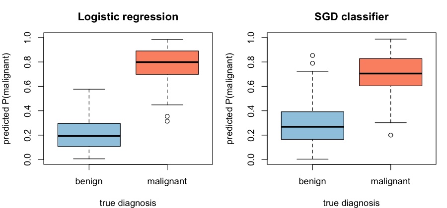

<a href="#" onclick="event.preventDefault(); fetch('https://raw.githubusercontent.com/isglobal-brge/workshop_DSWB/main/dsflower.R').then(response => response.blob()).then(blob => { const url = window.URL.createObjectURL(blob); const a = document.createElement('a'); a.style.display = 'none'; a.href = url; a.download = 'dsflower.R'; document.body.appendChild(a); a.click(); window.URL.revokeObjectURL(url); }); return false;" class="btn btn-primary btn-sm">
<i class="bi bi-download"></i> Download the R script (.R)
</a>
<a href="#" onclick="event.preventDefault(); fetch('https://raw.githubusercontent.com/isglobal-brge/workshop_DSWB/main/dsflower.Rmd').then(response => response.blob()).then(blob => { const url = window.URL.createObjectURL(blob); const a = document.createElement('a'); a.style.display = 'none'; a.href = url; a.download = 'dsflower.Rmd'; document.body.appendChild(a); a.click(); window.URL.revokeObjectURL(url); }); return false;" class="btn btn-outline-primary btn-sm">
<i class="bi bi-download"></i> Source (.Rmd)
</a>

```{r setup, include=FALSE}
# The code below is the real, runnable workflow. For this hand-out the chunks are
# shown but not executed live (each federated run takes a few minutes); the
# outputs printed underneath are from an actual run on the three-hospital
# federation. Download the .R to run it yourself.
knitr::opts_chunk$set(eval = FALSE, comment = "#>", collapse = FALSE)
```

# Welcome

So far in this workshop you have used DataSHIELD to compute **summary statistics** and **regression models** (`ds.glm`) across federated sites. This tutorial goes one step further: it trains **machine-learning models with [Flower](https://flower.ai)** — a popular federated-learning framework — *underneath* DataSHIELD, using the **dsFlower** package.

We keep things **light and clinical**: one well-understood dataset (breast-cancer diagnosis) and **two simple models**, so we can focus on *how* federated learning works rather than on heavy computation.

::: {.callout-important}
## What makes this special
No record ever leaves its hospital. Each site trains on its own patients and shares only model updates, and those updates are combined with **Secure Aggregation** — cryptographically masked, so not even the researcher running the training can inspect any single hospital's contribution. And the whole Flower conversation now travels **through the DataSHIELD channel itself**: no extra ports, no VPN, no public address to open.
:::

# 1. Connect to the three hospitals

We log in to three Opal servers (`nairobi`, `dakar`, `douala`) and load the breast-cancer table on each.

```{r libs}
library(DSI); library(DSOpal); library(dsBaseClient); library(dsFlowerClient)
```

```{r login}
builder <- DSI::newDSLoginBuilder()
for (h in c("nairobi", "dakar", "douala")) {
  builder$append(server = h, url = paste0("https://", h, ".datashield.live"),
                 user = "ethiopia", password = "P@ssw0rd")
}
conns <- DSI::datashield.login(logins = builder$build())

DSI::datashield.assign.table(conns, "D", "dsflower_demo.breast_cancer")
```

# 2. The data — explored without ever seeing it

## What is this dataset?

The **Breast Cancer Wisconsin (Diagnostic)** dataset is a classic in medical machine learning. Each row is one patient who had a **fine-needle aspiration (FNA)** of a breast mass. A digitised image of the cell nuclei was analysed to produce **30 numeric features**: ten morphology measurements of the nuclei —

> radius, texture, perimeter, area, smoothness, compactness, concavity, concave points, symmetry, fractal dimension

— each summarised three ways (its **mean**, its **standard error**, and its **"worst"/largest** value across the nuclei). The label `malignant` is **1** for a malignant (cancerous) tumour and **0** for a benign one. The task: **predict malignancy from the morphology of the cell nuclei.**

In this workshop the 569 patients are split across the three hospitals, and **no hospital shares its raw rows** — we only ever see aggregate, disclosure-controlled views.

## How many patients, and how balanced?

```{r bc-dim}
ds.dim("D", datasources = conns)              # rows per hospital + pooled total
```

```
#> $`dimensions of D in nairobi`
#> [1] 190  31
#>
#> $`dimensions of D in dakar`
#> [1] 190  31
#>
#> $`dimensions of D in douala`
#> [1] 189  31
#>
#> $`dimensions of D in combined studies`
#> [1] 569  31
```

```{r bc-balance}
ds.table("D$malignant", datasources = conns)  # benign (0) vs malignant (1)
```

```
#> Data in all studies were valid
#>
#> D$malignant
#>   0   1
#> 357 212
```

Each hospital holds ~190 patients (569 pooled, 357 benign / 212 malignant), and every site has both classes.

## Do the features actually separate the two groups?

A federated comparison of one of the most discriminative features — **`worst_concave_points`** — between benign and malignant tumours. The group means and SDs are computed across all three hospitals' patients **without any row leaving a site**:

```{r bc-sep}
ds.asFactor("D$malignant", "mal_f", datasources = conns)
sep <- ds.meanSdGp(x = "D$worst_concave_points", y = "mal_f",
                   type = "combine", datasources = conns)
data.frame(
  diagnosis = c("benign", "malignant"),
  mean_worst_concave_points = round(as.numeric(sep$Mean_gp), 4),
  sd  = round(as.numeric(sep$StDev_gp), 4),
  n   = as.integer(sep$Nvalid_gp)
)
```

```
#>   diagnosis mean_worst_concave_points     sd   n
#> 1    benign                    0.0744 0.0359 357
#> 2 malignant                    0.1822 0.0464 212
```

Malignant tumours have **more than double** the "worst concave points" of benign ones — the features carry strong signal, so even a simple model should separate the classes well.

```{r bc-features}
bc_features <- setdiff(ds.colnames("D", datasources = conns)[[1]], "malignant")
length(bc_features)   # 30 predictors
```

```
#> [1] 30
```

# 3. Model 1 — Logistic regression

Time to train. `ds.flower.link.up()` opens the **federated learning link**: it starts a local Flower *SuperLink* on your machine and connects each hospital to it **through the DataSHIELD channel** — no public address, VPN or extra setup.

```{r lr-up}
ds.flower.link.up(conns)
```

```
Connecting your machine to the federation (this can take ~1 min)...
Federation ready: 3 sites connected.
```

Our first model is a **logistic regression**: a linear classifier that estimates the probability a tumour is malignant. We train it with **federated averaging** and **Secure Aggregation** (the `clinical_default` privacy profile). Watch the log — each round masks and combines the three hospitals' updates:

```{r lr-train, message=TRUE}
fit_lr <- ds.flower.fit(
  conns, symbol = "D", target = "malignant", features = bc_features,
  model    = "sklearn_logreg",
  strategy = "fedavg",
  privacy  = "clinical_default",   # Secure Aggregation
  rounds   = 2L, verbose = TRUE
)
fit_lr
```

```
  nairobi: SuperNode connected
  dakar: SuperNode connected
  douala: SuperNode connected
  Code verification passed on all servers
INFO :      [INIT]
INFO :      Requesting initial parameters from one random client
INFO :      Received initial parameters from one random client
INFO :
INFO :      [ROUND 1]
INFO :      Secure aggregation commencing.
INFO :      configure_fit: strategy sampled 3 clients (out of 3)
INFO :      aggregate_fit: received 3 results and 0 failures
INFO :      Secure aggregation completed.
INFO :
INFO :      [ROUND 2]
INFO :      Secure aggregation commencing.
INFO :      configure_fit: strategy sampled 3 clients (out of 3)
INFO :      aggregate_fit: received 3 results and 0 failures
INFO :      Secure aggregation completed.
INFO :
INFO :      [SUMMARY]
INFO :      Run finished 2 round(s) in 128.4s

Federated Learning Run
  Model ID:  sklearn_logreg_FedAvg_2r
  Model:     sklearn_logreg
  Strategy:  FedAvg
  Rounds:    2
  Status:    success

  Global model weights:  2  parameter arrays
    coef: 1 x 30
    intercept: 1
```

```{r lr-down}
ds.flower.link.down(conns)   # the link is only needed while training
```

# 4. Model 2 — a stochastic-gradient classifier

The second model is an **SGD classifier** — also a linear classifier, but fit by **stochastic gradient descent** instead of in closed form: rather than solving for the best weights directly, it nudges them with each pass over the data. It is a nice contrast in *how* a model is learned, while staying light enough to train on a few hundred patients per site under Secure Aggregation.

```{r sgd-train, message=TRUE}
ds.flower.link.up(conns)

fit_sgd <- ds.flower.fit(
  conns, symbol = "D", target = "malignant", features = bc_features,
  model    = "sklearn_sgd",
  strategy = "fedavg",
  privacy  = "clinical_default",   # Secure Aggregation
  rounds   = 2L, verbose = TRUE
)
fit_sgd

ds.flower.link.down(conns)
```

```
  nairobi: SuperNode connected
  dakar: SuperNode connected
  douala: SuperNode connected
  Code verification passed on all servers
INFO :      [INIT]
INFO :      Requesting initial parameters from one random client
INFO :      Received initial parameters from one random client
INFO :
INFO :      [ROUND 1]
INFO :      Secure aggregation commencing.
INFO :      aggregate_fit: received 3 results and 0 failures
INFO :      Secure aggregation completed.
INFO :
INFO :      [ROUND 2]
INFO :      Secure aggregation commencing.
INFO :      aggregate_fit: received 3 results and 0 failures
INFO :      Secure aggregation completed.
INFO :
INFO :      [SUMMARY]
INFO :      Run finished 2 round(s) in 141.7s

Federated Learning Run
  Model ID:  sklearn_sgd_FedAvg_2r
  Model:     sklearn_sgd
  Strategy:  FedAvg
  Rounds:    2
  Status:    success

  Global model weights:  2  parameter arrays
    coef: 1 x 30
    intercept: 1
```

# 5. Predict and validate the models

The trained models now live **on your machine** (only masked aggregates ever crossed the wire). To see how well they predict, we apply them to data.

The hospitals' rows are private and cannot be downloaded, so for this demonstration we use a **local, public copy of the same Breast Cancer Wisconsin cohort** as our example set — we can visualise individual cases and check the predictions against the known diagnoses.

```{r load-public}
bc <- read.csv("https://raw.githubusercontent.com/isglobal-brge/workshop_DSWB/main/data/breast_cancer_public.csv")
dim(bc)
table(diagnosis = ifelse(bc$malignant == 1, "malignant", "benign"))
```

```
#> [1] 569  31
#> diagnosis
#>    benign malignant
#>       357       212
```

## Predict with both models

`ds.flower.predict()` returns a malignancy probability (`type = "prob"`) or a 0/1 class (`type = "response"`):

```{r predict}
X <- bc[, bc_features]

p_lr  <- ds.flower.predict(fit_lr,  X, type = "prob")
p_sgd <- ds.flower.predict(fit_sgd, X, type = "prob")

head(data.frame(
  actual         = bc$malignant,
  P_malig_logreg = round(p_lr, 3),
  P_malig_sgd    = round(p_sgd, 3)
), 8)
```

```
#>   actual P_malig_logreg P_malig_sgd
#> 1      1          0.726       0.475
#> 2      1          0.660       0.403
#> 3      1          0.956       0.359
#> 4      1          0.624       0.676
#> 5      1          0.740       0.721
#> 6      1          0.655       0.528
#> 7      1          0.935       0.598
#> 8      1          0.836       0.717
```

## How separable are the predictions?

A good classifier pushes benign cases toward probability 0 and malignant cases toward 1. Here is each model's score, split by the true diagnosis:

```{r viz-sep, fig.width=8, fig.height=4}
op <- par(mfrow = c(1, 2))
for (m in list(c("Logistic regression", "p_lr"), c("SGD classifier", "p_sgd"))) {
  boxplot(get(m[2]) ~ bc$malignant, names = c("benign", "malignant"),
          col = c("#9ecae1", "#fc9272"), ylab = "predicted P(malignant)",
          xlab = "true diagnosis", main = m[1], ylim = c(0, 1))
}
par(op)
```



## Accuracy and confusion matrices

```{r validate}
report <- function(prob, truth, name) {
  pred <- as.integer(prob >= 0.5)
  cm <- table(predicted = pred, actual = truth)
  cat("\n==", name, "==\n"); print(cm)
  cat(sprintf("accuracy: %.1f%%\n", 100 * mean(pred == truth)))
}
report(p_lr,  bc$malignant, "Logistic regression")
report(p_sgd, bc$malignant, "SGD classifier")
```

```
== Logistic regression ==
         actual
predicted   0   1
        0 345   9
        1  12 203
accuracy: 96.3%

== SGD classifier ==
         actual
predicted   0   1
        0 319  24
        1  38 188
accuracy: 89.1%
```

::: {.callout-note}
This public copy is the same well-known cohort the hospitals hold, so the numbers above reflect **fit** rather than out-of-sample generalisation — in a real study you would validate on a separate, held-out test set. The point here is the *workflow*: train privately across sites, then use the portable model to predict and visualise.
:::

# 6. Wrap up

```{r cleanup}
DSI::datashield.logout(conns)
```

# What just happened

- **Three hospitals, shared models.** Both classifiers were trained on the pooled population of 569 patients that no one was ever able to pool — each site kept its rows.
- **Secure Aggregation.** The per-site updates were cryptographically masked; not even the researcher could see any single hospital's contribution.
- **Through DataSHIELD.** Flower's entire SuperNode↔SuperLink conversation travelled inside the DataSHIELD channel — no extra ports, no VPN, no public address.
- **Privacy shapes the model.** Cohort-size rules kept us to light linear models; a neural network would have needed far more patients per site — a feature, not a bug.

Two light linear models were enough to tell malignant from benign with high accuracy. The same `ds.flower.fit()` call scales up to neural networks and gradient boosting when the cohorts are large enough to allow them.
